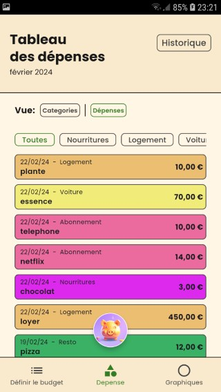

# Bling

Il s'agit d'une petite application personnelle en cours de développement.

Cette application a pour but d'aider à gérer son budget mensuel.

Le design est réalisé par vincent roux: https://www.linkedin.com/in/vincent-roux-9abb12158/

Lien playstore: Non disponible


## Installation

```
Flutter 3.19.1 • channel stable • https://github.com/flutter/flutter.git
Framework • revision abb292a07e (2 days ago) • 2024-02-20 14:35:05 -0800
Engine • revision 04817c99c9
Tools • Dart 3.3.0 • DevTools 2.31.1
```

Pour compiler et lancer le project lancer les commande suivantes :
- `flutter clean`
- `flutter pub get`
- `flutter pub upgrade`
- `flutter run`

## images de l'application





